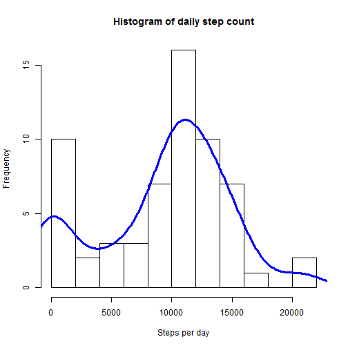

## Loading and preprocessing the data

Here we load existing zip file that came with package and do initial summary.

```r
# This is necessary unless you want graphs in your local region format
Sys.setlocale("LC_TIME", "C");
```

[1] "C"

```r
library(data.table)
library(dplyr)

filename <- unzip("./activity.zip")
data <- fread(filename)
data <- mutate(data, date=as.Date(date)) %>%group_by(date)
```

## What is mean total number of steps taken per day?

Let`s see, how many steps study subject walked, For this, we 
initially find how many steps subject took each day and then see frequency on
histogram.

**NB! For this part of study, we ignore missing values in data set.**

1. Calculate the total number of steps taken per day

```r
summ <- summarise(data
                  , steps.total=sum(steps, na.rm = T)            
                  )
```

2. If you do not understand the difference between a histogram and a barplot, 
research the difference between them. Make a histogram of the total number of 
steps taken each day.

I have also added density curve, this part of code was found from:

http://stackoverflow.com/questions/20078107/overlay-normal-curve-to-histogram-in-r


```r
orighist <- hist(summ$steps.total
     , breaks = 15
     , plot=FALSE
     )

# from http://stackoverflow.com/questions/20078107/overlay-normal-curve-to-histogram-in-r
multiplier <- orighist$counts / orighist$density
origdensity <- density(summ$steps.total)
origdensity$y <- origdensity$y * multiplier[1]

plot(orighist, xlab="Steps per day"
     , main="Histogram of daily step count")
lines(origdensity, lwd=3, col="blue")
```

 

3. Calculate and report the mean and median of the total number of steps taken 
per day


```r
mean(summ$steps.total)
```

```
## [1] 9354.23
```

```r
median(summ$steps.total)
```

```
## [1] 10395
```


## What is the average daily activity pattern?


1. Make a time series plot (i.e. type = "l") of the 5-minute interval (x-axis) 
and the average number of steps taken, averaged across all days (y-axis)

Lets find out, how average day looks like for test subject. To do this, we 
group original dataset by interval and then summarize, using mean function.

**NB! For this part of study, we ignore missing values in data set as well.**


```r
summ2 <- data %>% 
            group_by(interval) %>% 
            summarise(
                stepAverage=mean(steps, na.rm=T)
                , stepStd=sd(steps, na.rm=T)
            )

plot(summ2$interval, 
    summ2$stepAverage, 
    type="l", 
    xlab="Interval", 
    ylab="Steps per interval" 
    )
title("Agerage steps by 5-minute interval across all days")
```

 

2. Which 5-minute interval, on average across all the days in the dataset, 
contains the maximum number of steps?

We report interval sequence number 

```r
which.max(summ2$stepAverage)
```

```
## [1] 104
```

As well as interval value which has maximum number of steps

```r
summ2[which.max(summ2$stepAverage),]
```

```
## Source: local data table [1 x 3]
## 
##   interval stepAverage  stepStd
## 1      835    206.1698 292.9958
```

And mark this as a rug on plot


```r
plot(summ2$interval, 
    summ2$stepAverage, 
    type="l", 
    xlab="Interval", 
    ylab="Steps per interval" 
    )
title("Agerage steps by 5-minute interval across all days")
rug(c(summ2[which.max(summ2$stepAverage),]$interval), col="red", lwd=3)
```

 


## Imputing missing values

Note that there are a number of days/intervals where there are missing values 
(coded as NA). The presence of missing days may introduce bias into some 
calculations or summaries of the data.

1. Calculate and report the total number of missing values in the dataset (i.e. 
the total number of rows with NAs)


```r
 sum(!complete.cases(data))
```

```
## [1] 2304
```

2. Devise a strategy for filling in all of the missing values in the dataset. 
The strategy does not need to be sophisticated. For example, you could use the 
mean/median for that day, or the mean for that 5-minute interval, etc.

**Strategy**

If value is missing, then I use completed cases average of that particular
interval + randomized value within range of square root of standard deviation 
of that interval. Negative values are replaced with zero. Results of this block
is hidden not to clutter output.

3. Create a new dataset that is equal to the original dataset but with the 
missing data filled in.


```r
setkey(summ2, interval)
setkey(data, date, interval)

set.seed(1)

data3 <- merge(data, summ2, by=c('interval'))[order(date,interval)]

data3[, x:=rnorm(nrow(data3),stepAverage, sqrt(stepStd))]
data3[x<0, x:=0 ]
data3[, x:=as.integer(round(x,0)) ]
data3[is.na(steps), steps:=x]

data3 <- select(data3, steps, date, interval)
```

4. Make a histogram of the total number of steps taken each day 


```r
summ22 <-data3 %>% 
            group_by(date) %>% 
              summarise(
                   steps.total=sum(steps, na.rm = F)            
              )


newhist <- hist(summ22$steps.total
     , breaks = 15
     , plot=FALSE
     )

# from http://stackoverflow.com/questions/20078107/overlay-normal-curve-to-histogram-in-r
multiplier <- newhist$counts / newhist$density
newdensity <- density(summ22$steps.total)
newdensity$y <- newdensity$y * multiplier[1]

plot(newhist, xlab="Steps per day"
     , main="Histogram of daily step count with NA-s imputed")
lines(origdensity, lwd=3, col="red")
lines(newdensity, lwd=3, col="blue")
legend("topright"
    , lty=c(1,1)
    , col = c("red", "blue")
    , legend = c("NA-s not imputed", "NA-s imputed")
    )
```

 

and Calculate and report the mean and median total number of steps taken per day. 


```r
mean(summ22$steps.total)
```

```
## [1] 10768.48
```

```r
median(summ22$steps.total)
```

```
## [1] 10809
```

Do these values differ from the estimates from the first part of the assignment? 
What is the impact of imputing missing data on the estimates of the total daily 
number of steps?

*Yes, values differ. As NA-s were replaced with actual values higher than zero,*
*mean and median increased in absolute value and also got closed together. Also,*
*since some missing values were replaced with quite higher numbers than zero then*
*histogram bucket closer to zero sharply lost members and resulting graph is more*
*focused around mean value.*


## Are there differences in activity patterns between weekdays and weekends?

For this part the weekdays() function may be of some help here. Use the dataset 
with the filled-in missing values for this part.

1. Create a new factor variable in the dataset with two levels "weekday" and
"weekend" indicating whether a given date is a weekday or weekend day.

**NB! Not displaying results of this part**


```r
data3[, weekday := factor(weekdays(data3$date) == "Saturday" | 
                          weekdays(data3$date) == "Sunday", 
                        labels=c("weekday", "weekend"))]


summ4 <- data3 %>% 
  group_by(weekday, interval) %>% 
  summarise(
    stepAverage=mean(steps, na.rm=T)
    , stepStd=sd(steps, na.rm=T)
  )
```


2. Make a panel plot containing a time series plot (i.e. type = "l") of the 
5-minute interval (x-axis) and the average number of steps taken, averaged 
across all weekday days or weekend days (y-axis). See the README file in the 
GitHub repository to see an example of what this plot should look like using 
simulated data.

We use lattice to plot it


```r
library(lattice)


xyplot(summ4$stepAverage ~ summ4$interval | summ4$weekday
       , layout = c(1, 2)
       , type="l"
       , xlab="Interval"
       , ylab="Number of steps"
       )
```

 

*Yes, it can be seen that averages for weekday and weekend differ a little,*
*weekdays having lower daily activity but starting earlier when weekend*
*is quite active for all day long.*
